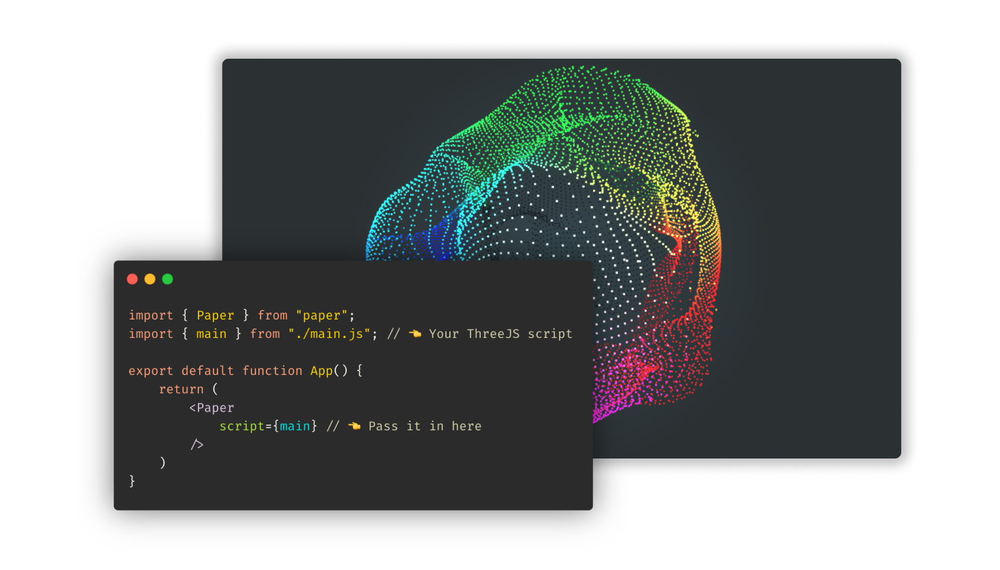

<br />
<p align="center">
    
  <h1 align="center">react-three-paper</h1>
  
  <p align="center">
    A paper-thin (~800 bytes<sup>*</sup>) and position-aware wrapper for ThreeJS in React.
    <br />
    <a href="https://farazzshaikh.github.io/react-three-paper/">View Demo</a>
    ·
    <a href="https://github.com/FarazzShaikh/react-three-paper/issues/new">Report Bug</a>
  </p>
  <p align="center">
    <a href="https://www.npmjs.com/package/react-three-paper"></a>
  </p>

  <p align="center">
    My work is for and funded by the community. If you used this or found this helpful consider supporting me.
  </p>

  <p align="center">
    <a href="https://farazzshaikh.github.io/experiments/examples/support.html?via=ETH"></a>
    <a href="https://farazzshaikh.github.io/experiments/examples/support.html?via=BTC"></a>
    <a href="https://farazzshaikh.github.io/experiments/examples/support.html?via=DOGE"></a>
     <a href="https://paypal.me/farazzshaikh"></a>
  </p>
</p>


<br />

  <p align="center">
    </img>
    65k particles in React using Three.js via <code>react-three-paper</code>.
  </p>

<br />

<sup>*</sup> Not including the Source Map and types.

## But why?

I use this component a lot when creating React-based apps. A prominent example is [my blog](https://github.com/FarazzShaikh/blog) and I am kinda sick of rewriting it again and again.

But other than that, here are some actual uses over using something like `react-three-fiber`:

- Very easily port Vanilla-JS scripts to React.
- No special declarative syntax to learn.
- Separate your UI logic from your core ThreeJS app.
- It is **TINY**.

In theory, all you have to do to convert Vanilla-JS examples to React ones via this library is wrap them in a `main()` function, tell ThreeJS to render on the given canvas, and return the render loop as a function. [Read more.](#your-script)

## Position aware...what?

Yes, the canvas knows when it is out of the viewport and will pause your render loop. It will resume it when it is back in the viewport. This is **TREMENDOUSLY** helpful with performance. 

For example, when creating long pages where you have multiple ThreeJS canvas components coming in and going out of the viewport.

You can also tap these events and define custom behavior.

## Installation

```bash
npm install react-three-paper
# or
yarn add react-three-paper
```

**`react-three-paper` requires `react >=16.8.0`**

```bash
npm install react
# or
yarn add react
```

## Usage

Import the `Paper` component and use it like this:

```jsx
import { Paper } from "paper";
import { main } from "./main.js"; // 👈 Your ThreeJS script

export default function App() {
    return (
        <Paper 
            script={main} // 👈 Pass it in here
        />
    )
}
```

### Your script

The `script` prop accepts a function, here is how that function should look.

```js
export async function main(canvas) {
    //...Do ThreeJS stuff
    const renderer = new THREE.WebGLRenderer({
        canvas: canvas, // 👈 Use canvas as the ThreeJS canvas
    });

    // 👇 Use canavs dimentions insted of window
    const aspectRatio = canvas.clientWidth / canvas.clientHeight;
    renderer.setSize(canvas.clientWidth, canvas.clientHeight);

    function render() {...} //...Render loop without requestAnimationFrame()
    function cleanup() {...} //...Any cleanup youd like (optional)

    return { render, cleanup }
}
```

Essentially, a function that receives a `canvas` element (that is used as the ThreeJS canvas) and returns a promise which resolves to a couple of functions.

- `render`: Your render loop without `requestAnimationFrame` as this is handled by `react-three-paper`.
- `cleanup`: An optional cleanup function without `cancleAnimationFrame`.

**Pass this function directly into the `script` prop.**

### Example

An example app can be found within the `example` directory. It is also hosted [here](https://farazzshaikh.github.io/react-three-paper/example). See:

- `example/src/App.js`: For `Paper` component usage. 
- `example/src/three/main.js`: For an example of how to format your main function.

### Advanced Usage

Here are some other props that `react-three-paper` provides.

```jsx
import { Paper } from "../../build/index";
import { main } from "./three/main.js";

export default function App() {
    return (
        <Paper 
            script={main}
            style={{...}} // 👈 CSS styles for the underlying <canvas>

            // 👇 Events
            onExit={(entry, ID) => {...}} // 👈 Fired when canvas exits the viewport
            onEntry={(entry, ID) => {...}} // 👈 Fired when canvas enters the viewport
            onError={(error, ID) => {...}} // 👈 Fired when there is a error
        />
    )
}
```

| Prop | Required | Type | Discription | Default |
|-|-|-|-|-|
| script | Yes | [`tPaperScript`](#tpaperscript) | Your ThreeJS script | No default behaviour |
| style | No | [`React.CSSProperties`](https://reactjs.org/docs/faq-styling.html) | CSS  styles for the underlying `<canvas>` | Makes the canvas dimensions 100% of its container. |
| onExit | No | [`tPaperPositionEvent`](#tpaperpositionevent) | Fired when canvas exits the viewport | Stops the render loop when canvas exits viewport. |
| onEntry | No | [`tPaperPositionEvent`](#tpaperpositionevent) | Fired when canvas enters the viewport | Start the render loop when canvas enters viewport. |
| onError | No | [`tPaperErrorEvent`](#tpapererrorevent) | Fired when there is a error | Logs the error and stops the render loop. |

**Note: Default behavioir cannot be overwritten, only extended.**

### Types

#### `tPaperRenderLoop`

A function that receives current time. By default, it is run every frame.

```js
(time?: number) => void
```

#### `tPaperCleanup`

An optional cleanup function.

```js
() => void
```

#### `tPaperScriptReturn`

The return value of the function is passed to the `script` prop.

```ts
type tPaperScriptReturn = {
  render: tPaperRenderLoop;
  cleanup: tPaperCleanup;
};
```

#### `tPaperScript`

A function that recieves a HTML canvas and returns a promise that resolves to [tPaperScriptReturn](#tpaperscriptreturn) (your render loop).

```js
(canvas?: HTMLCanvasElement) => Promise<tPaperScriptReturn>
```

#### `tPaperPositionEvent`

A function that receives the Intersection observer event's entry object. Use this to have custom behavior when the canvas goes out of and comes into the viewport. This function is called when the canvas enters or leaves the viewport.

```js
(entry: IntersectionObserverEntry) => void;
```

#### `tPaperErrorEvent`

This function is called when an error occurs. It receives the error.

```js
(error: Error) => void;
```

This module provides TypeScript type definitions.